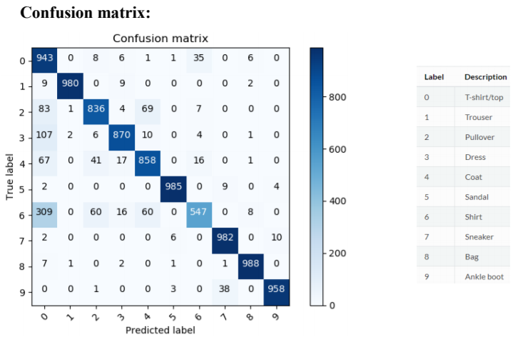

# Fashion-MNIST Classification

In this Python program an Artificial Neural Network is trained in order to classify fashion item images ([fashion-mnist 
dataset](https://github.com/zalandoresearch/fashion-mnist)).

## Usage

```bash
py classifyFashionMNIST.py
```

## Example

```bash
py .\classifyFashionMNIST.py
    Found 1000 correct labels using the untrained model
    Found 9000 incorrect labels using the untrained model
    Train on 48000 samples, validate on 12000 samples
    Epoch 1/12
    .
    .
    .
    Epoch 12/12
    Training time: 2014.26
    Test loss: 0.25
    Test accuracy: 0.91
    Found 9106 correct labels
    Found 894 incorrect labels
```

## Requirements

In order to run the code, install the following packages:
- numpy
- sklearn
- matplotlib
- tensorflow==1.5
- keras

## Description

The data-set contains 60,000 images and it's split as:
- Training set (48,000 images)
- Validation set (12,000 images)
- Test set (10,000 images)

## Network Architecture

| Layer (type)                  | Output Shape        | Param # |
|-------------------------------|---------------------|---------|
| conv2d_1 (Conv2D)             | (None, 28, 28, 128) | 2176    |
| max_pooling2d_1 (MaxPooling2) | (None, 14, 14, 128) | 0       |
| dropout_1 (Dropout)           | (None, 14, 14, 128) | 0       |
| conv2d_2 (Conv2D)             | (None, 14, 14, 128) | 262272  |
| max_pooling2d_2 (MaxPooling2) | (None, 7, 7, 128)   | 0       |
| dropout_2 (Dropout)           | (None, 7, 7, 128)   | 0       |
| flatten_1 (Flatten)           | (None, 6272)        | 0       |
| dense_1 (Dense)               | (None, 64)          | 401472  |
| dropout_3 (Dropout)           | (None, 64)          | 0       |
| dense_2 (Dense)               | (None, 256)         | 16640   |
| dropout_4 (Dropout)           | (None, 256)         | 0       |
| dense_3 (Dense)               | (None, 10)          | 2570    |

## Results



## Author

Giorgos Argyrides (g.aryrides@outlook.com)